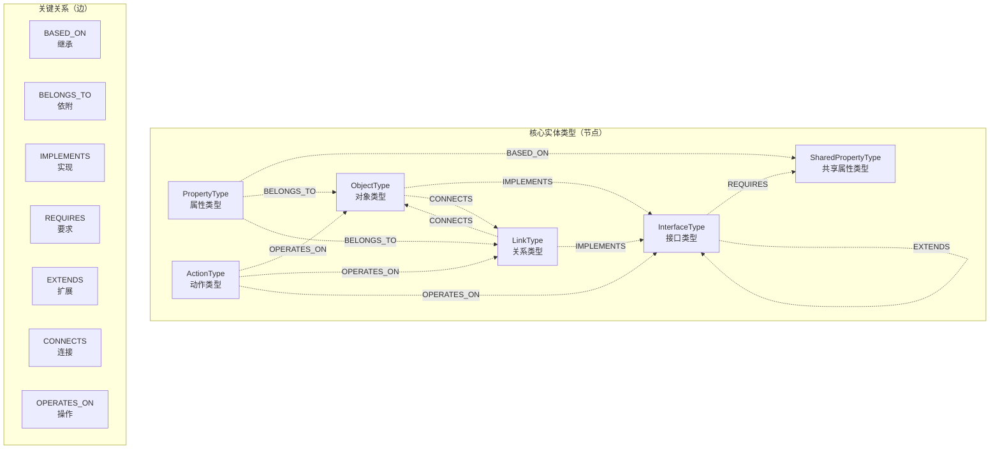
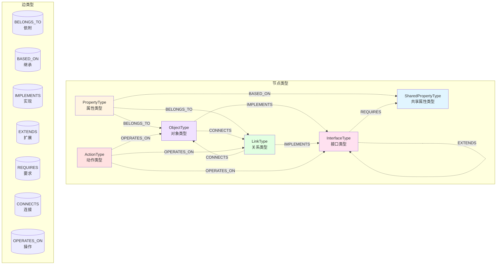

# ONTOLOGY.md - DataOS (LingShu) 本体系统完整指南

> **版本**: 1.3.0
> **更新日期**: 2026-03-01
> **维护者**: DataOS Team
> **状态**: 活跃维护

---

## 前言

### 参考文档

Ontology 的 Proto 定义见：
- `proto/ontology.proto` - 核心 Ontology 定义
- `proto/interaction.proto` - UI 组件配置
- `proto/common.proto` - 数据类型和资产映射
- `proto/validation.proto` - 校验规则定义

**本文档基于上述 Proto 定义编写，Proto 是源头真理。**

### 什么是 Ontology

**Ontology（本体）** 是 DataOS (LingShu) 项目的核心数据模型系统，定义了整个业务领域的对象类型、属性、关系、接口和动作。所有模块（前端、后端、AI Agent）都围绕 Ontology 展开。

### 设计哲学

**1. 定义与实例分离**
- Ontology 定义数据的 **形状**（Schema）
- Data Instances 定义数据的 **内容**（Data）
- 两者独立存储、独立版本化

**2. 逻辑与物理分离**
- **逻辑模型**：Ontology 定义业务概念（如"机器人"、"位置"、"电量"）
- **物理模型**：AssetMapping 定义存储位置（如 Iceberg 表、PostgreSQL 表）
- 逻辑模型独立于物理存储，可切换底层存储

**3. 图模型思维**
- 所有 Ontology 实体都是图中的 **节点**（Node）
- 实体之间的关联关系是图中的 **边**（Edge）
- 通过图遍历实现级联更新、依赖校验、影响分析

### 图模型概览



---

## 目录

- [第一部分：实体类型定义](#第一部分实体类型定义)
  - [第1章：OntologyRegistry（注册表）](#第1章ontologyregistry注册表)
    - [1.1 定义与作用](#11-定义与作用)
    - [1.2 包含的实体类型](#12-包含的实体类型)
    - [1.3 RID 格式](#13-rid-格式)
    - [1.4 api_name 命名规范](#14-api_name-命名规范)
  - [第2章：SharedPropertyType（共享属性类型）](#第2章sharedpropertytype共享属性类型)
  - [第3章：PropertyType（属性类型）](#第3章propertytype属性类型)
  - [第4章：InterfaceType（接口类型）](#第4章interfacetype接口类型)
  - [第5章：ObjectType（对象类型）](#第5章objecttype对象类型)
  - [第6章：LinkType（关系类型）](#第6章linktype关系类型)
  - [第7章：ActionType（动作类型）](#第7章actiontype动作类型)
- [第二部分：关系与机制](#第二部分关系与机制)
  - [第8章：关系图谱（7种边类型）](#第8章关系图谱7种边类型)
  - [第9章：依赖关系与级联更新](#第9章依赖关系与级联更新)
  - [第10章：版本管理](#第10章版本管理)
    - [10.1 四阶段模型（Draft → Staging → Snapshot → Active）](#101-四阶段模型draft--staging--snapshot--active)
    - [10.2 版本管理属性（Neo4j 图节点/关系属性）](#102-版本管理属性neo4j-图节点关系属性)
    - [10.3 冲突检测与回滚](#103-冲突检测与回滚)
- [第三部分：深度专题](#第三部分深度专题)
  - [第11章：Virtual Expression 虚拟字段](#第11章virtual-expression-虚拟字段)
  - [第12章：Widget Config UI 配置](#第12章widget-config-ui-配置)
  - [第13章：AssetMapping 读写分离](#第13章assetmapping-读写分离)
  - [第14章：Compliance 合规与脱敏](#第14章compliance-合规与脱敏)
- [第四部分：附录](#第四部分附录)
  - [附录A：完整字段索引](#附录a完整字段索引)
  - [附录B：枚举值索引](#附录b枚举值索引)
  - [附录C：关系图谱总览](#附录c关系图谱总览)
    - [C.1 7种边类型汇总图](#c1-7种边类型汇总图)
  - [附录D：校验规则定义](#附录d校验规则定义)
    - [D.1 属性级校验（PropertyValidationConfig）](#d1-属性级校验propertyvalidationconfig)
    - [D.2 实体级校验（EntityValidationConfig）](#d2-实体级校验entityvalidationconfig)

---

# 第一部分：实体类型定义

## 第1章：OntologyRegistry（注册表）

### 1.1 定义与作用

**OntologyRegistry** 是顶层容器，打包所有 Ontology 定义。

**作用**：
- 作为 Ontology 数据的 **根对象**（Root Object）
- 存储 **版本号**（version），标识整个 Ontology 的版本
- 存储所有实体类型的映射表（Map<RID, Definition>）
- 提供 **单一入口**（Single Entry Point）访问整个 Ontology

### 1.2 包含的实体类型

OntologyRegistry 包含以下 5 类实体的集合：

| 实体类型 | 字段名 | RID 前缀 | 说明 |
|---------|--------|----------|------|
| SharedPropertyType | shared_property_types | ri.shprop | 共享属性类型定义 |
| InterfaceType | interface_types | ri.iface | 接口类型定义 |
| ObjectType | object_types | ri.obj | 对象类型定义 |
| LinkType | link_types | ri.link | 关系类型定义 |
| ActionType | action_types | ri.action | 动作类型定义 |

### 1.3 RID 格式

所有 Ontology 实体使用统一的 RID（Resource Identifier）格式：

```
ri.{entity_type}.{uuid}

示例：
ri.shprop.123e4567-e89b-12d3-a456-426614174000  (SharedPropertyType)
ri.prop.123e4567-e89b-12d3-a456-426614174000   (PropertyType)
ri.iface.123e4567-e89b-12d3-a456-426614174000  (InterfaceType)
ri.obj.123e4567-e89b-12d3-a456-426614174000    (ObjectType)
ri.link.123e4567-e89b-12d3-a456-426614174000   (LinkType)
ri.action.123e4567-e89b-12d3-a456-426614174000 (ActionType)
```

### 1.4 api_name 命名规范

所有 Ontology 实体的 `api_name` 字段使用 **snake_case** 命名风格：

**格式约束**：
- 只能包含小写字母（a-z）、数字（0-9）、下划线（_）
- 不能以数字开头
- 不能连续使用下划线
- 不能以 underscores 结尾

**示例**：
- ✅ `battery_level`
- ✅ `serial_number`
- ✅ `has_battery`
- ❌ `BatteryLevel`（不能用大写字母）
- ❌ `battery-level`（不能用连字符）
- ❌ `123_position`（不能以数字开头）

---

## 第2章：SharedPropertyType（共享属性类型）

### 2.1 定义与作用

**SharedPropertyType** 是全局可复用的属性定义（模板/蓝图），定义了属性的元数据和行为规则。

**作用**：
- 定义属性的 **数据类型**（data_type）
- 定义属性的 **UI 展示方式**（widget_config）
- 定义属性的 **校验规则**（validation）
- 定义属性的 **合规要求**（compliance）
- 作为 PropertyType 的 **继承源头**（通过 BASED_ON 边）
- **被 InterfaceType 引用**（通过 REQUIRES 边）—— InterfaceType 只能引用 SharedPropertyType，不能引用 PropertyType

### 2.2 RID 格式

```
ri.shprop.{uuid}
```

### 2.3 使用场景

SharedPropertyType 用于定义 **跨对象类型复用** 的属性模板：

**示例 1：电量属性**
- 定义 SharedPropertyType "battery_level"（data_type: INTEGER）
- Robot 对象的 PropertyType "robot_battery_level" 继承此 SharedPropertyType
- Drone 对象的 PropertyType "drone_battery_level" 继承此 SharedPropertyType

**示例 2：位置属性**
- 定义 SharedPropertyType "location"（data_type: STRING, widget: MAP_PIN）
- Robot 对象的 PropertyType "robot_location" 继承此 SharedPropertyType
- ChargingStation 对象的 PropertyType "station_location" 继承此 SharedPropertyType

**复用优势**：
- 统一数据定义（避免重复定义）
- 统一校验规则（所有继承者共享）
- 级联更新（修改 SharedPropertyType 自动同步到所有继承它的 PropertyType）

---

## 第3章：PropertyType（属性类型）

### 3.1 定义与作用

**PropertyType** 是依附于 ObjectType 或 LinkType 的具体属性定义，可以选择继承 SharedPropertyType。

**作用**：
- 定义 Object 或 Link 的 **属性集合**
- 支持继承 SharedPropertyType（详细规则见 3.3 节）
- 定义属性的 **物理存储**（physical_column）或 **虚拟计算**（virtual_expression）

### 3.2 RID 格式

```
ri.prop.{uuid}
```

### 3.3 与 SharedPropertyType 的关系

PropertyType 通过 `inherit_from_shared_property_type_rid` 字段继承 SharedPropertyType：

**继承规则**：
- PropertyType 可以继承 SharedPropertyType 的所有字段
- PropertyType 可以覆盖部分字段（如 display_name、description）
- PropertyType **不能覆盖** data_type（保证类型一致性）

### 3.4 依附关系（BELONGS_TO 边）

PropertyType 必须依附于一个父实体（ObjectType 或 LinkType）：

**依附关系**：
- PropertyType → ObjectType（属性属于对象）
- PropertyType → LinkType（属性属于关系）

**说明**：每个 PropertyType 必须依附于一个 ObjectType 或 LinkType，通过 BELONGS_TO 边连接。

### 3.5 backing 字段

PropertyType 使用 `oneof backing` 表示数据来源有两种方式：

**1. physical_column（物理列）**
- 直接映射到数据库表的物理列
- 示例：`physical_column: "battery_level"`
- 适用于：存储在数据库的实际数据

**2. virtual_expression（虚拟表达式）**
- 通过表达式计算得出
- 示例：`virtual_expression: "battery_level * 100"`（转换为百分比）
- 适用于：计算字段、派生数据

---

## 第4章：InterfaceType（接口类型）

### 4.1 定义与作用

**InterfaceType** 定义契约（Contract），规定实现者必须满足的要求。

**作用**：
- 定义 ObjectType 或 LinkType 的 **形状约束**（Shape Constraint）
- 定义 **属性要求**（required_shared_property_type_rids）—— **只能引用 SharedPropertyType，不能引用 PropertyType**
- 定义 **关系要求**（link_requirements）
- 支持 **接口继承**（extends_interface_type_rids）

### 4.2 RID 格式

```
ri.iface.{uuid}
```

### 4.3 两种类型

InterfaceType 分为两类（由 `InterfaceCategory` 枚举定义）：

**1. OBJECT_INTERFACE（对象接口）**
- 定义 ObjectType 的形状（必须包含哪些属性，通过引用 SharedPropertyType 定义要求）
- 定义出边约束（必须有哪些 LinkType）
- 示例：HasBattery 接口定义形状（要求包含 battery_level 等属性），并定义出边约束（必须有 ChargingTo 关系）

**2. LINK_INTERFACE（关系接口）**
- 定义 LinkType 的形状（必须包含哪些属性，通过引用 SharedPropertyType 定义要求）
- 定义端点约束（source/target 必须是什么类型）
- 示例：ConnectsToCharger 接口定义形状（要求包含 start_time 等属性），并定义端点约束（source 是 Device，target 是 Charger）

### 4.4 与 SharedPropertyType 的关系（REQUIRES 边）

InterfaceType 通过 `required_shared_property_type_rids` 字段要求实现者必须包含某些 SharedPropertyType：

**约束机制**：
- InterfaceType 定义要求："实现我这个接口，就必须有这些共享属性类型"
- 当 ObjectType/LinkType 实现一个 InterfaceType 时，必须满足其属性要求

### 4.5 继承关系（EXTENDS 边）

InterfaceType 支持接口继承（通过 `extends_interface_type_rids` 字段）：

**继承规则**：
- 子接口继承父接口的所有要求
- 子接口可以添加额外要求
- 不支持循环继承（通过图遍历检测）

**示例**：
```
InterfaceType "Flyable"（可飞行接口）
    └── required_properties: [altitude, speed]

InterfaceType "TrackableDrone"（可追踪无人机接口）
    ├── extends: "Flyable"
    └── required_properties: [gps_location, last_seen_time]
```

---

## 第5章：ObjectType（对象类型）

### 5.1 定义与作用

**ObjectType** 定义业务对象的类型。

**作用**：
- 定义对象的 **属性集合**（property_types）
- 定义对象实现的 **接口**（implements_interface_type_rids）
- 定义对象的 **主键**（primary_key_property_type_rids）
- 定义对象的 **资产映射**（asset_mapping）

### 5.2 RID 格式

```
ri.obj.{uuid}
```

### 5.3 与 PropertyType 的关系（BELONGS_TO 边）

ObjectType 包含多个 PropertyType，通过 BELONGS_TO 边连接：

**属性集合**：
- ObjectType.property_types 是一个 Map<string, PropertyTypeDefinition>
- Key 为 api_name，Value 为 PropertyType 完整定义
- 每个 PropertyType 通过 BELONGS_TO 边依附于 ObjectType

### 5.4 与 InterfaceType 的关系（IMPLEMENTS 边）

ObjectType 可以实现多个 InterfaceType，通过 IMPLEMENTS 边连接：

**实现关系**：
- ObjectType.implements_interface_type_rids 是一个数组
- 每个 InterfaceType 通过 IMPLEMENTS 边连接到 ObjectType
- Object 必须满足所实现 InterfaceType 的所有契约要求

### 5.5 主键定义（primary_key_property_type_rids）

ObjectType 通过 `primary_key_property_type_rids` 定义主键：

**主键类型**：
- 单主键：包含一个 PropertyType 的 RID
- 复合主键：包含多个 PropertyType 的 RID

### 5.6 AssetMapping（资产映射）

ObjectType 包含 `AssetMapping` 定义物理存储映射：

**作用**：将逻辑模型（Ontology）映射到物理数据源（Iceberg 表、PostgreSQL 表等）

**详细说明**：见第 13 章《AssetMapping 读写分离》

---

## 第6章：LinkType（关系类型）

### 6.1 定义与作用

**LinkType** 定义对象之间的关系类型。

**作用**：
- 定义关系的 **端点**（source_type, target_type）
- 定义关系的 **基数**（Cardinality：1:1, 1:N, M:N）
- 定义关系的 **属性**（property_types）
- 定义关系实现的 **接口**（implements_interface_type_rids）

### 6.2 RID 格式

```
ri.link.{uuid}
```

### 6.3 端点定义（source_type, target_type）

Link 的 source 和 target 可以指向：

**1. 具体的 ObjectType**
- 通过 `source_object_type_rid` 或 `target_object_type_rid` 指定

**2. InterfaceType**
- 通过 `source_interface_type_rid` 或 `target_interface_type_rid` 指定
- 表示"所有实现该接口的对象"可以作为端点

### 6.4 基数（Cardinality）

Link 的基数定义关系的数量约束：

| 枚举值 | 说明 | 示例 |
|--------|------|------|
| ONE_TO_ONE | 一对一 | 机器人 ↔ 唯一充电槽 |
| ONE_TO_MANY | 一对多 | 机器人 ↔ 多个任务记录 |
| MANY_TO_MANY | 多对多 | 机器人 ↔ 多个充电站 |

### 6.5 与 InterfaceType 的关系（IMPLEMENTS 边）

LinkType 可以实现 InterfaceType，通过 IMPLEMENTS 边连接：

**LINK_INTERFACE 的实现**：
- Link 实现 LINK_INTERFACE 类型的 InterfaceType
- 必须满足 InterfaceType 定义的端点约束

### 6.6 AssetMapping（资产映射）

LinkType 也包含 `AssetMapping` 定义物理存储映射。

**详细说明**：见第 13 章《AssetMapping 读写分离》

---

## 第7章：ActionType（动作类型）

### 7.1 定义与作用

**ActionType** 定义可以作用于 ObjectType 或 LinkType 的操作。

**作用**：
- 定义操作的 **参数**（parameters）
- 定义操作的 **执行引擎**（execution.engine）
- 定义操作的 **安全级别**（safety_level）
- 定义操作的 **副作用声明**（side_effects）

### 7.2 RID 格式

```
ri.action.{uuid}
```

### 7.3 参数定义（ActionParameter）

Action 的参数通过 `ActionParameter` 定义：

**参数来源**（`definition_source` oneof）：

**1. derived_from_object_type_rid（对象实例引用）**
- 该参数是一个**对象实例引用**，引用指定 ObjectType 的 RID
- 运行时，用户选择该 ObjectType 的一个实例作为参数值，Action 执行逻辑可访问该实例的任意属性
- 后端根据此参数建立 OPERATES_ON 边

**2. derived_from_link_type_rid（关系实例引用）**
- 该参数是一个**关系实例引用**，引用指定 LinkType 的 RID
- 运行时，用户选择该 LinkType 的一个实例作为参数值，Action 执行逻辑可访问该实例的任意属性
- 后端根据此参数建立 OPERATES_ON 边

**3. derived_from_interface_type_rid（接口实例引用）**
- 该参数是一个**接口实例引用**，引用指定 InterfaceType 的 RID
- 运行时，用户选择实现该接口的任意类型的一个实例作为参数值，Action 执行逻辑可访问该实例的任意属性
- 后端根据此参数建立 OPERATES_ON 边

**4. explicit_type（显式类型）**
- 该参数是一个**原始值**，直接指定数据类型（DataType 枚举值）
- 运行时，用户输入对应类型的值（如字符串、整数等）

### 7.4 执行配置（execution.engine）

Action 的执行引擎类型：

| 枚举值 | 说明 |
|--------|------|
| ENGINE_NATIVE_CRUD | 原生 CRUD 操作（增删改查） |
| ENGINE_PYTHON_VENV | Python 虚拟环境执行 |
| ENGINE_SQL_RUNNER | SQL 查询执行器 |
| ENGINE_WEBHOOK | Webhook 调用 |

**执行模式**：
- `is_batch`：是否支持批量操作
- `is_sync`：是否同步执行

### 7.5 安全级别（safety_level）

Action 的安全级别定义操作的潜在风险：

| 枚举值 | 说明 | 示例 |
|--------|------|------|
| SAFETY_READ_ONLY | 只读操作 | 查询机器人状态 |
| SAFETY_IDEMPOTENT_WRITE | 幂等写操作 | 更新机器人配置 |
| SAFETY_NON_IDEMPOTENT | 非幂等操作 | 启动机器人任务 |
| SAFETY_CRITICAL | 关键操作 | 删除机器人数据 |

### 7.6 副作用声明（side_effects）

Action 声明可能的副作用：

| 枚举值 | 说明 |
|--------|------|
| DATA_MUTATION | 数据变更 |
| DATA_DELETION | 数据删除 |
| NOTIFICATION | 发送通知 |
| EXTERNAL_API_CALL | 调用外部 API |
| BILLING_EVENT | 计费事件 |
| ACCESS_CONTROL | 权限变更 |
| OTHER | 其他副作用 |

---

# 第二部分：关系与机制

## 第8章：关系图谱（7种边类型）

Ontology 系统定义了 7 种边类型，表达实体之间的不同关系：

### 8.1 BELONGS_TO（属性属于实体）

**定义**：PropertyType 依附于 ObjectType 或 LinkType

**方向**：PropertyType → ObjectType/LinkType

### 8.2 BASED_ON（属性继承共享属性）

**定义**：PropertyType 继承 SharedPropertyType

**方向**：PropertyType → SharedPropertyType

### 8.3 IMPLEMENTS（实现接口）

**定义**：ObjectType/LinkType 实现 InterfaceType

**方向**：ObjectType/LinkType → InterfaceType

### 8.4 EXTENDS（接口继承）

**定义**：InterfaceType 继承父 InterfaceType

**方向**：子接口 → 父接口

### 8.5 CONNECTS（关系端点）

**定义**：LinkType 的 source 和 target 端点

**方向**：
- (source ObjectType/InterfaceType) → LinkType
- LinkType → (target ObjectType/InterfaceType)

**说明**：通过边的方向区分 source（指向 LinkType）和 target（从 LinkType 指出）

### 8.6 REQUIRES（接口要求属性）

**定义**：InterfaceType 要求实现者包含某些 SharedPropertyType

**方向**：InterfaceType → SharedPropertyType

### 8.7 OPERATES_ON（动作操作对象）

**定义**：ActionType 操作的 ObjectType、LinkType 或 InterfaceType

**方向**：ActionType → ObjectType/LinkType/InterfaceType

**实现方式**：通过 ActionParameter 中的以下参数之一建立，后端逻辑根据参数创建 OPERATES_ON 边：
- `derived_from_object_type_rid`
- `derived_from_link_type_rid`
- `derived_from_interface_type_rid`

---

## 第9章：依赖关系与级联更新

### 9.1 依赖关系分析

Ontology 系统中存在多种依赖关系，修改某个实体可能影响其他实体。

**SharedPropertyType 的依赖**：
- 被 PropertyType 继承（BASED_ON 边）
- 被 InterfaceType 引用（REQUIRES 边）

**PropertyType 的依赖**：
- 依附于 ObjectType 或 LinkType（BELONGS_TO 边）

**InterfaceType 的依赖**：
- 被 ObjectType/LinkType 实现（IMPLEMENTS 边）
- 被 InterfaceType 继承（EXTENDS 边）
- 被 ActionType 操作（OPERATES_ON 边）

**ObjectType 的依赖**：
- 被 LinkType 端点引用（CONNECTS 边）
- 被 ActionType 操作（OPERATES_ON 边）

**LinkType 的依赖**：
- 被 ActionType 操作（OPERATES_ON 边）

### 9.2 继承机制

PropertyType 通过 `inherit_from_shared_property_type_rid` 字段继承 SharedPropertyType。

**继承机制**：
- PropertyType 继承 SharedPropertyType 的所有字段
- 继承是**静态绑定**（创建时确定）
- 继承关系通过 BASED_ON 边表达
- 继承后可以覆盖部分字段

**使用场景**：

**场景 1：同一属性在不同对象中的不同显示名称**
- SharedPropertyType 定义通用属性（如"序列号"）
- Robot 对象的 PropertyType 覆盖显示名为"机器人序列号"
- Charger 对象的 PropertyType 覆盖显示名为"充电器序列号"

**场景 2：同一属性在不同对象中的不同校验规则**
- SharedPropertyType 定义通用温度范围
- 机器人温度 PropertyType 覆盖为工作温度范围
- 电池温度 PropertyType 覆盖为安全温度范围

**场景 3：同一属性的不同 UI 展示方式**
- SharedPropertyType 使用默认文本框
- 机器人位置 PropertyType 覆盖为地图标记组件

**覆盖机制的核心价值**：
1. **上下文适配**：同一属性在不同业务场景中有不同的展示和行为
2. **类型安全**：继承 SharedPropertyType 的 data_type，保证类型一致性
3. **灵活定制**：可覆盖 display_name、validation、widget 等非核心字段
4. **统一管理**：修改 SharedPropertyType 仍可级联更新到未覆盖的字段

**覆盖检测机制**：

系统通过**字段值比较**来判断 PropertyType 是否覆盖了 SharedPropertyType 的字段：
- 级联更新时比较 PropertyType 和 SharedPropertyType 的字段值
- 值相同则认为继承（级联更新会传播）
- 值不同则认为覆盖（级联更新会跳过）

**字段覆盖行为**：

| 字段 | 可覆盖 | 说明 |
|------|--------|------|
| rid | 否 | 唯一标识符，每个实体独立 |
| api_name | 是 | API 调用标识可以自定义 |
| display_name | 是 | 显示名称可以自定义 |
| description | 是 | 描述可以自定义 |
| lifecycle_status | 否 | 生命周期状态，每个实体独立 |
| data_type | 否 | 数据类型不能覆盖（保证类型一致性） |
| widget | 是 | UI 配置可以自定义 |
| validation | 是 | 校验规则可以自定义 |
| compliance | 是 | 合规配置可以自定义 |

**说明**：此表仅列出 SharedPropertyTypeDefinition 和 PropertyTypeDefinition 共有的字段。PropertyType 独有的 `inherit_from_shared_property_type_rid` 和 `backing`（physical_column / virtual_expression）不涉及覆盖。

### 9.3 级联更新执行

修改 SharedPropertyType 时自动级联更新：

**级联路径**：

1. **SharedPropertyType 修改** → 影响范围：
   - 继承它的 PropertyType（BASED_ON 边）
   - 引用它的 InterfaceType（REQUIRES 边）

2. **PropertyType 修改** → 影响范围：
   - 包含它的 ObjectType（BELONGS_TO 边）
   - 包含它的 LinkType（BELONGS_TO 边）

3. **InterfaceType 修改** → 影响范围：
   - 实现它的 ObjectType（IMPLEMENTS 边）
   - 实现它的 LinkType（IMPLEMENTS 边）
   - 继承它的子 InterfaceType（EXTENDS 边）

**级联逻辑**：
1. 查询所有基于此 SharedPropertyType 的 PropertyType（通过 BASED_ON 边）
2. 过滤未覆盖变更字段的 PropertyType
3. 批量创建 PropertyType 新版本
4. 查询拥有这些 PropertyType 的 ObjectType/LinkType
5. 批量创建 ObjectType/LinkType 新版本

### 9.4 循环依赖检测

系统通过图遍历检测循环依赖：

**检测场景**：
- InterfaceType 继承循环（A EXTENDS B, B EXTENDS A）
- ObjectType 实现循环（通过 InterfaceType 间接形成循环）

**检测算法**：
- 深度优先搜索（DFS）
- 遍历路径中出现重复节点 → 存在循环
- 抛出 CircularDependencyError 异常

---

## 第10章：版本管理

### 10.1 四阶段模型（Draft → Staging → Snapshot → Active）

Ontology 版本管理采用四阶段模型：

**Draft（用户级草稿）**
- 用户个人的临时编辑空间
- 多用户并发编辑不同对象，通过对象级锁隔离
- 仅草稿所有者可见
- 状态标记：`is_draft = true`, `draft_owner = user_id`
- **创建方式**：用户从 Active 状态开始编辑时，系统从 Active 节点**克隆**出 Draft 节点；从 Staging 状态继续编辑时，从 Staging 节点**克隆**出 Draft 节点（Staging 节点保持不变，独立存在）
- **孤儿 Draft 清理**：获取编辑锁时，若发现该实体已有其他用户的无锁 Draft（锁已过期），自动丢弃该孤儿 Draft

**Staging（租户级预发布）**
- 租户的"开发环境"，汇总多个用户提交的修改
- 等待管理员审查后统一发布到生产环境
- 租户内所有用户可见
- 状态标记：`is_staging = true`
- **状态转换**：Draft → Staging 时，若无已有 Staging 则原地修改标记（`is_draft = false, is_staging = true`，不创建新节点）；若已有 Staging（二次编辑场景）则用 Draft 内容更新 Staging 后删除 Draft

**Snapshot（版本历史）**
- PostgreSQL 中存储的不可变版本历史
- 每次发布 Staging 时创建新的 Snapshot
- 用于审计、对比和回滚
- 不作为图节点，通过 `snapshot_id` 属性关联

**Active（当前生效版本）**
- 当前生产环境的生效版本
- 通过标记（is_active）区分，不是独立的节点集合
- Active 本质上是某个 Snapshot 版本的节点在 Neo4j 中的标记状态
- 状态标记：`is_active = true`, `snapshot_id = snap_xxx`

### 10.2 版本管理属性（Neo4j 图节点/关系属性）

**重要说明**：以下版本管理属性是 **Neo4j 图数据库中节点和关系的属性**，不是 OntologyRegistry Proto 消息的字段。这些属性用于在图数据库中管理 Ontology 实体的版本状态。

所有存储在 Neo4j 中的 Ontology 实体（节点和关系）都包含以下版本管理属性：

```json
{
  // 版本阶段标记
  is_draft: Boolean,      // 是否为草稿状态
  is_staging: Boolean,    // 是否为暂存状态

  // 实体存活标记
  is_active: Boolean,     // 该实体在此节点语境下是否存活

  // 版本信息
  snapshot_id: String | NULL,         // 所属快照 ID
  parent_snapshot_id: String | NULL,  // 基于的版本（用于冲突检测）

  // Draft 专属
  draft_owner: String | NULL,         // 草稿所有者（仅 Draft 状态）

  // 租户隔离
  tenant_id: String                   // 租户标识（所有实体必须）
}
```

**三个标记的语义与真值表**：

`is_draft` 和 `is_staging` 互斥，不会同时为 `true`。两者都为 `false` 表示正式节点（已发布）。`is_active` 表示该实体在此节点语境下是否存活——在 Draft/Staging 上代表发布后的目标状态（意图），在正式节点上代表当前事实。

| is_draft | is_staging | is_active | 含义 |
|----------|-----------|-----------|------|
| true | false | true | Draft：新建或修改 |
| true | false | false | Draft：删除 |
| false | true | true | Staging：新建或修改 |
| false | true | false | Staging：删除 |
| false | false | true | 当前生效版本 |
| false | false | false | 历史版本（已归档 / 软删除） |

**属性说明**：

1. **is_draft（草稿标记）**：
   - 个人编辑的草稿，仅 `draft_owner` 可见
   - 与 `is_staging` 互斥

2. **is_staging（暂存标记）**：
   - 租户级预发布，等待管理员审查
   - 与 `is_draft` 互斥

3. **is_active（实体存活标记）**：
   - 在 Draft/Staging 节点上：`true` = 新建或修改意图，`false` = 删除意图
   - 在正式节点上：`true` = 当前生效版本，`false` = 已归档或软删除
   - **注意**：`is_active` 与 `is_draft`/`is_staging` 不互斥，它是独立的语义维度

4. **snapshot_id（所属快照 ID）**：
   - 记录实体所属的版本快照 ID
   - Draft 和 Staging 状态：`snapshot_id = NULL`
   - Active 状态：`snapshot_id` 指向对应的 PostgreSQL 快照记录
   - 用途：查询历史版本（`WHERE snapshot_id = 'snap_100'`）
   - **注意**：Snapshot 不作为图节点，通过属性关联

5. **parent_snapshot_id（基于的版本）**：
   - 记录 Draft 实体克隆自哪个版本的快照 ID
   - 从 Active 创建 Draft 时：复制 Active 的 `snapshot_id` 到 `parent_snapshot_id`
   - 新创建实体：`parent_snapshot_id = NULL`（无 Active 版本）
   - 用途：提交时冲突检测（乐观锁）
   - 检测逻辑：`parent_snapshot_id = NULL` 跳过冲突检测；否则比较与当前 Active 的 `snapshot_id`，不一致则拒绝提交并提示用户刷新

6. **draft_owner（Draft 所有者）**：
   - 记录 Draft 的所有者（user_id）
   - 实现对象级锁：同一对象同时只有一个用户的 Draft
   - Draft 状态：`draft_owner = 'user_alice'`
   - Staging/Active 状态：`draft_owner = NULL`

7. **tenant_id（租户标识）**：
   - 所有节点和关系必须包含租户标识
   - 用于逻辑隔离（Neo4j Community Edition 方案）
   - 查询时强制过滤：`WHERE tenant_id = 'xxx'`

### 10.3 冲突检测与回滚

**冲突检测（乐观锁）**：
- 使用 `parent_snapshot_id` 实现乐观锁
- 提交时检查当前 Active 版本的 `snapshot_id` 是否变化
- 版本不一致 → 拒绝提交，提示用户刷新

**回滚策略**：
- 回滚前必须清空所有 Draft 和 Staging（避免回滚后版本状态混乱）
- 回滚不创建新 Snapshot（回滚不算新版本）
- 只修改 `is_active` 标记，切换到历史版本
- 可以在任意版本间来回切换

---

# 第三部分：深度专题

## 第11章：Virtual Expression 虚拟字段

### 11.1 定义

PropertyType 的 `virtual_expression` 是 `oneof backing` 的一个分支，与 `physical_column` 互斥。当属性值不直接来自物理存储列，而是通过计算得出时，使用 virtual_expression。

在 Proto 中，`virtual_expression` 是一个 `string` 类型字段，表达式的语法和执行语义由应用层定义。

**示例**：
```
virtual_expression: "battery_level * 100"
virtual_expression: "end_time - start_time"
```

### 11.2 计算时机

**计算模式**：
- **实时计算**：查询时动态计算（最新值）
- **预计算**：写入时计算并缓存（性能优先）

---

## 第12章：Widget Config UI 配置

### 12.1 Widget 类型

PropertyType 的 `widget` 字段定义 UI 展示方式：

| Widget 类型 | 说明 | 适用数据类型 |
|------------|------|-------------|
| WidgetText | 文本输入框 | STRING |
| WidgetLink | 超链接 | STRING (URL) |
| WidgetAvatar | 头像 | ATTACHMENT (图片) |
| WidgetStatus | 状态标签 | STRING (枚举) |
| WidgetMapPin | 地图标记 | STRING (坐标) |
| WidgetCode | 代码块 | STRING (代码) |
| WidgetImage | 图片预览 | ATTACHMENT (图片) |
| WidgetDate | 日期选择器 | DATE/TIMESTAMP |
| WidgetUserSelector | 用户选择器 | STRING (用户ID) |

---

## 第13章：AssetMapping 读写分离

### 13.1 读路径（read_connection_id + read_asset_path）

读路径定义数据查询的来源：

**配置**：
- `read_connection_id`：连接配置 ID（指向基础设施配置）
- `read_asset_path`：资产路径（如 Iceberg 表路径）

**示例**：
```
read_connection_id: "iceberg_catalog"
read_asset_path: "clean_layer.db_robot.t_robot_snapshot"
```

### 13.2 写路径（writeback_enabled + writeback_asset_path）

写路径定义数据写入的目标：

**配置**：
- `writeback_enabled`：是否启用回写（布尔值）
- `writeback_connection_id`：写入连接 ID
- `writeback_asset_path`：写入路径（增量表）

**示例**：
```
writeback_enabled: true
writeback_connection_id: "iceberg_catalog"
writeback_asset_path: "sys_layer.edits.t_robot_delta"
```

---

## 第14章：Compliance 合规与脱敏

### 14.1 Sensitivity 敏感度

PropertyType 的 `compliance.sensitivity` 定义数据敏感度：

| 枚举值 | 说明 | 示例 |
|--------|------|------|
| PUBLIC | 公开数据 | 产品名称 |
| INTERNAL | 内部数据 | 员工工号 |
| CONFIDENTIAL | 机密数据 | 客户信息 |
| RESTRICTED | 限制数据 | 身份证号 |

### 14.2 MaskingStrategy 脱敏策略

PropertyType 的 `compliance.masking` 定义脱敏策略：

| 策略 | 说明 | 示例 |
|------|------|------|
| MASK_NONE | 不脱敏 | 显示完整数据 |
| MASK_NULLIFY | 置空 | 显示为空 |
| MASK_REDACT_FULL | 全部隐藏 | 显示为 `***` |
| SHOW_LAST_4 | 显示后4位 | `1234` |
| SHOW_FIRST_2 | 显示前2位 | `12****` |
| MASK_EMAIL_DOMAIN | 隐藏邮箱域 | `***@example.com` |
| MASK_EMAIL_USER | 隐藏邮箱用户名 | `user@***.com` |
| MASK_PHONE_MIDDLE | 隐藏手机中间4位 | `138****5678` |

---

# 第四部分：附录

## 附录A：完整字段索引

### A.1 按实体索引

#### OntologyRegistry
| 字段名 | 类型 | 说明 |
|--------|------|------|
| version | string | 版本号 |
| shared_property_types | map<string, SharedPropertyTypeDefinition> | 共享属性类型集合 |
| interface_types | map<string, InterfaceTypeDefinition> | 接口类型集合 |
| object_types | map<string, ObjectTypeDefinition> | 对象类型集合 |
| link_types | map<string, LinkTypeDefinition> | 关系类型集合 |
| action_types | map<string, ActionTypeDefinition> | 动作类型集合 |

#### SharedPropertyTypeDefinition
| 字段名 | 类型 | 必填 | 说明 |
|--------|------|------|------|
| rid | string | 是 | 资源标识符 |
| api_name | string | 是 | API 名称（使用 snake_case，见 1.4 节） |
| display_name | string | 是 | 显示名称 |
| description | string | 否 | 描述 |
| lifecycle_status | LifecycleStatus | 是 | 生命周期状态 |
| data_type | DataType | 是 | 数据类型 |
| widget | WidgetConfig | 否 | UI 组件配置 |
| validation | PropertyValidationConfig | 否 | 属性级校验配置（见附录 D） |
| compliance | ComplianceConfig | 否 | 合规配置 |

#### PropertyTypeDefinition
| 字段名 | 类型 | 必填 | 说明 |
|--------|------|------|------|
| rid | string | 是 | 资源标识符 |
| api_name | string | 是 | API 名称（使用 snake_case，见 1.4 节） |
| display_name | string | 是 | 显示名称 |
| description | string | 否 | 描述 |
| lifecycle_status | LifecycleStatus | 是 | 生命周期状态 |
| data_type | DataType | 是 | 数据类型 |
| inherit_from_shared_property_type_rid | string | 否 | 继承的共享属性类型 RID |
| backing (oneof) | physical_column / virtual_expression | 否 | 物理列或虚拟表达式 |
| widget | WidgetConfig | 否 | UI 组件配置 |
| validation | PropertyValidationConfig | 否 | 属性级校验配置（见附录 D） |
| compliance | ComplianceConfig | 否 | 合规配置 |

#### InterfaceTypeDefinition
| 字段名 | 类型 | 必填 | 说明 |
|--------|------|------|------|
| rid | string | 是 | 资源标识符 |
| api_name | string | 是 | API 名称（使用 snake_case，见 1.4 节） |
| display_name | string | 是 | 显示名称 |
| description | string | 否 | 描述 |
| lifecycle_status | LifecycleStatus | 是 | 生命周期状态 |
| category | InterfaceCategory | 是 | 接口分类（OBJECT_INTERFACE/LINK_INTERFACE） |
| extends_interface_type_rids | repeated string | 否 | 继承的接口类型 RID 列表 |
| required_shared_property_type_rids | repeated string | 否 | 要求的共享属性类型 RID 列表 |
| link_requirements | repeated ObjectLinkRequirement | 否 | 对象链接要求（仅 OBJECT_INTERFACE） |
| object_constraint | LinkObjectConstraint | 否 | 链接对象约束（仅 LINK_INTERFACE） |

#### ObjectTypeDefinition
| 字段名 | 类型 | 必填 | 说明 |
|--------|------|------|------|
| rid | string | 是 | 资源标识符 |
| api_name | string | 是 | API 名称（使用 snake_case，见 1.4 节） |
| display_name | string | 是 | 显示名称 |
| description | string | 否 | 描述 |
| lifecycle_status | LifecycleStatus | 是 | 生命周期状态 |
| property_types | map<string, PropertyTypeDefinition> | 是 | 属性类型集合 |
| implements_interface_type_rids | repeated string | 否 | 实现的接口类型 RID 列表 |
| primary_key_property_type_rids | repeated string | 是 | 主键属性 RID 列表 |
| validation | EntityValidationConfig | 否 | 实体级校验配置（见附录 D） |
| asset_mapping | AssetMapping | 是 | 资产映射 |

#### LinkTypeDefinition
| 字段名 | 类型 | 必填 | 说明 |
|--------|------|------|------|
| rid | string | 是 | 资源标识符 |
| api_name | string | 是 | API 名称（使用 snake_case，见 1.4 节） |
| display_name | string | 是 | 显示名称 |
| description | string | 否 | 描述 |
| lifecycle_status | LifecycleStatus | 是 | 生命周期状态 |
| source_type (oneof) | source_object_type_rid / source_interface_type_rid | 是 | 源类型 |
| target_type (oneof) | target_object_type_rid / target_interface_type_rid | 是 | 目标类型 |
| property_types | map<string, PropertyTypeDefinition> | 是 | 属性类型集合 |
| cardinality | Cardinality | 是 | 基数 |
| primary_key_property_type_rids | repeated string | 是 | 主键属性 RID 列表 |
| validation | EntityValidationConfig | 否 | 实体级校验配置（见附录 D） |
| implements_interface_type_rids | repeated string | 否 | 实现的接口类型 RID 列表 |
| asset_mapping | AssetMapping | 是 | 资产映射 |

#### ActionTypeDefinition
| 字段名 | 类型 | 必填 | 说明 |
|--------|------|------|------|
| rid | string | 是 | 资源标识符 |
| api_name | string | 是 | API 名称（使用 snake_case，见 1.4 节） |
| display_name | string | 是 | 显示名称 |
| description | string | 否 | 描述 |
| lifecycle_status | LifecycleStatus | 是 | 生命周期状态 |
| parameters | repeated ActionParameter | 是 | 参数列表 |
| execution | ActionExecutionConfig | 是 | 执行配置 |
| safety_level | ActionSafetyLevel | 是 | 安全级别 |
| side_effects | repeated SideEffectDeclaration | 是 | 副作用声明 |

#### 版本管理属性（Neo4j 图节点/关系属性）

**重要说明**：以下是 **Neo4j 图数据库中节点和关系的属性**，不是 OntologyRegistry Proto 消息的字段。这些属性用于在图数据库中管理 Ontology 实体的版本状态。详见第 10.2 节。

| 字段名 | 类型 | 说明 |
|--------|------|------|
| is_draft | Boolean | 是否为草稿状态（与 is_staging 互斥） |
| is_staging | Boolean | 是否为暂存状态（与 is_draft 互斥） |
| is_active | Boolean | 实体存活状态：Draft/Staging 上为意图，正式节点上为事实 |
| snapshot_id | string | 所属快照 ID（Draft/Staging 为 NULL） |
| parent_snapshot_id | string | 基于的版本（新创建实体为 NULL，用于冲突检测） |
| draft_owner | string | 草稿所有者（仅 Draft 状态） |
| tenant_id | string | 租户标识（所有实体必须） |

---

## 附录B：枚举值索引

### B.1 DataType 数据类型

| 枚举值 | 说明 | Proto 类型 |
|--------|------|-----------|
| DT_UNKNOWN | 未知类型 | - |
| DT_STRING | 字符串 | string |
| DT_INTEGER | 整数 | int32/int64 |
| DT_DOUBLE | 浮点数 | double |
| DT_BOOLEAN | 布尔值 | bool |
| DT_TIMESTAMP | 时间戳 | google.protobuf.Timestamp |
| DT_DATE | 日期 | google.protobuf.Timestamp |
| DT_ATTACHMENT | 附件 | string (URL/Path) |

### B.2 Cardinality 基数

| 枚举值 | 说明 | 图模型表示 |
|--------|------|-----------|
| CARDINALITY_UNSPECIFIED | 未指定 | - |
| ONE_TO_ONE | 一对一 | 1:1 |
| ONE_TO_MANY | 一对多 | 1:N |
| MANY_TO_MANY | 多对多 | M:N |

### B.3 LifecycleStatus 生命周期状态

| 枚举值 | 说明 | 用途 |
|--------|------|------|
| LIFECYCLE_UNSPECIFIED | 未指定 | - |
| ACTIVE | 活跃 | 生产可用 |
| EXPERIMENTAL | 实验性 | 测试中 |
| DEPRECATED | 已弃用 | 计划移除 |
| EXAMPLE | 示例 | 演示用途 |

---

## 附录C：关系图谱总览

### C.1 7种边类型汇总图



---

## 附录D：校验规则定义

校验规则定义在 `proto/validation.proto` 中，分为两个层级。

### D.1 属性级校验（PropertyValidationConfig）

用于 SharedPropertyTypeDefinition 和 PropertyTypeDefinition，校验单个属性值。

多条规则之间为 **AND** 关系（必须全部通过）。

**规则类型**（`PropertyValidationRule.rule` oneof）：

| 规则类型 | 说明 | 适用 DataType |
|---------|------|--------------|
| NotNullRule | 非空校验 | 所有类型 |
| RangeRule | 数值范围（min/max，支持开闭区间） | INTEGER / DOUBLE |
| LengthRule | 字符串长度（min_length/max_length） | STRING |
| PatternRule | 正则表达式匹配 | STRING |
| EnumRule | 枚举值约束（allowed_values 列表） | STRING / INTEGER |

**每条规则包含 `error_message` 字段**，校验失败时返回给用户。

### D.2 实体级校验（EntityValidationConfig）

用于 ObjectTypeDefinition 和 LinkTypeDefinition，校验实体内多个属性之间的约束关系。

多条规则之间为 **AND** 关系。

**规则类型**（`EntityValidationRule.rule` oneof）：

| 规则类型 | 说明 | 示例 |
|---------|------|------|
| CrossPropertyExpression | 跨属性表达式，引用属性用 `{api_name}` 语法 | `{end_time} > {start_time}` |

**每条规则包含 `error_message` 字段**，校验失败时返回给用户。

**表达式语法**：
- 引用属性：`{api_name}`（如 `{battery_level}`, `{start_time}`）
- 支持比较运算符：`>`, `>=`, `<`, `<=`, `==`, `!=`
- 初期仅支持二元比较，后续按需扩展

---

## 结语

本文档提供了 DataOS (LingShu) 项目 Ontology 系统的完整参考指南。Ontology 是整个系统的核心，理解 Ontology 是开发和维护 DataOS 的基础。

**核心概念回顾**：
- **SharedPropertyType** 是全局可复用的属性定义（模板）
- **PropertyType** 是依附于 ObjectType/LinkType 的具体属性（实例）
- **InterfaceType** 定义契约（Contract）
- **ObjectType** 定义对象类型（节点）
- **LinkType** 定义关系类型（边）
- **ActionType** 定义操作（动作）

**设计哲学**：
- 定义与实例分离
- 逻辑与物理分离
- 图模型思维

**关键机制**：
- 7种边类型表达实体关系（不含 Snapshot 相关边）
- 三层级联更新（SharedPropertyType → PropertyType → ObjectType/LinkType）
- 四阶段版本管理（Draft → Staging → Snapshot → Active）
- 版本管理属性（is_draft/is_staging 互斥标记版本阶段，is_active 独立标记实体存活状态，snapshot_id, parent_snapshot_id, tenant_id）

---

**文档维护**：本文档应随着 Ontology 系统的演进而持续更新。

**反馈渠道**：如有疑问或建议，请联系 DataOS Team。
