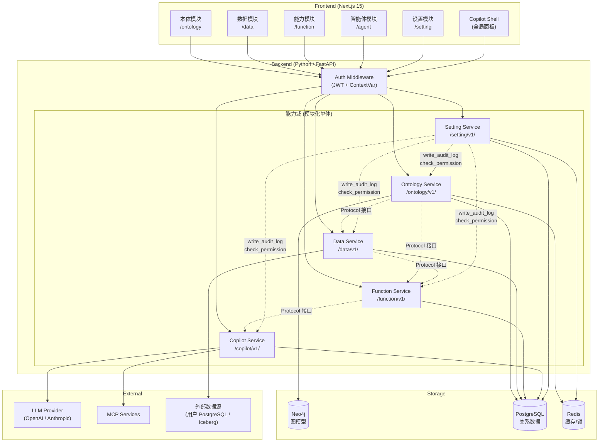
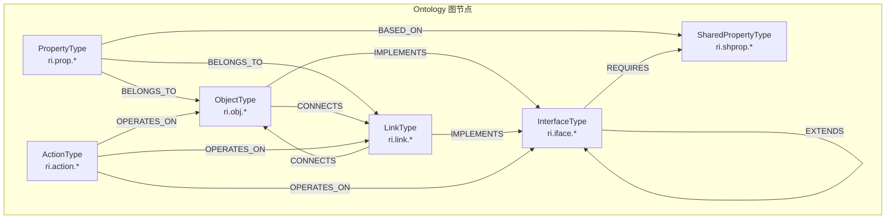

# TECHNICAL_DESIGN.md - LingShu 技术架构设计（实施版）

> **版本**: 1.0.0
> **创建日期**: 2026-03-11
> **状态**: 待确认
> **基于**: `DESIGN.md`、`TECH_DESIGN.md`、`PRODUCT_DESIGN.md`、各模块设计文档

---

## 1. 技术选型

### 1.1 前端

| 技术 | 版本 | 选型理由 |
|------|------|---------|
| **Next.js** | 15 (App Router) | React 生态最成熟的全栈框架；App Router 支持 RSC/Streaming/Parallel Routes；与 Vercel 生态深度集成 |
| **TypeScript** | 5.x | 强类型保障，减少运行时错误，提升重构安全性 |
| **Shadcn/UI** | latest | 基于 Radix UI 的组件库，可定制性强，不锁定依赖；与 Tailwind CSS 配合良好 |
| **Tailwind CSS** | 4.x | 原子化 CSS，开发效率高，生产 bundle 小 |
| **TanStack Query** | 5.x | 服务端状态管理，自动缓存/重试/乐观更新；替代手写 SWR/fetch 逻辑 |
| **Zustand** | 5.x | 轻量客户端状态管理，替代 Redux；仅用于 UI 状态（Tab 管理、Shell 开关等） |
| **React Flow** | 12.x | 工作流 DAG 编辑器、Ontology 拓扑图可视化 |
| **Monaco Editor** | latest | ActionType 的 Python/SQL 代码编辑器 |
| **Zod** | 3.x | Schema 验证，与 TypeScript 类型推导无缝配合；用于表单校验和 API 响应校验 |

**包管理器**: pnpm（workspace 支持、磁盘高效、锁文件确定性）

**测试框架**:
- 单元测试: Vitest
- 组件测试: Testing Library
- E2E 测试: Playwright

### 1.2 后端

| 技术 | 版本 | 选型理由 |
|------|------|---------|
| **Python** | 3.12+ | 统一后端语言，降低初期复杂度；LangGraph 仅支持 Python/JS |
| **FastAPI** | 0.115+ | 异步支持、自动 OpenAPI 文档、Pydantic 集成、性能优秀 |
| **Pydantic** | 2.x | 数据校验和序列化；DTO 定义；与 FastAPI 深度集成 |
| **SQLAlchemy** | 2.x | PostgreSQL ORM，支持异步（asyncpg）；Repository Pattern 实现 |
| **Alembic** | latest | 数据库迁移管理 |
| **LangGraph** | latest | Copilot Agent 引擎；有状态多步推理、interrupt/resume、checkpoint |
| **LangChain** | latest | LLM 工具链（仅 Copilot 使用，不扩散到其他模块） |
| **authlib** | latest | JWT 签发/校验，OIDC 兼容，P3 可直接切换外部 IdP |
| **passlib[bcrypt]** | latest | 密码哈希 |
| **casbin** | latest | RBAC/ABAC 权限框架，策略与代码解耦 |
| **neo4j-driver** | latest | Neo4j Python 异步驱动 |
| **httpx** | latest | 异步 HTTP 客户端（Webhook 引擎、MCP 调用） |

**包管理器**: uv（快速依赖解析、锁文件确定性、替代 pip/poetry）

**测试框架**:
- 单元测试: pytest + pytest-asyncio
- 集成测试: pytest + testcontainers（Docker 化依赖）
- 覆盖率: pytest-cov（目标 80%+）

**代码质量**:
- Linter: Ruff（替代 flake8/isort/black 三合一）
- 类型检查: mypy（strict 模式）
- Pre-commit hooks: ruff format + ruff check + mypy

### 1.3 存储

| 存储 | 用途 | 选型理由 |
|------|------|---------|
| **Neo4j** (Community) | Ontology 图模型（类型定义 + 关系 + 版本状态） | 图遍历天然适合依赖检测、级联更新；Cypher 查询语言直观 |
| **PostgreSQL** 16 | 版本快照、审计日志、用户/租户、Copilot 会话、Function 执行记录、工作流定义、Global Function | 关系型数据的标准选择；JSONB 支持灵活 schema；成熟可靠 |
| **Redis** 7 | JWT 黑名单、编辑锁、提交锁 | 低延迟分布式锁；Key TTL 自动清理 |

**P1+ 引入**:
| 存储 | 阶段 | 用途 |
|------|------|------|
| Iceberg + Nessie | P1 | 数据湖存储 + Git 风格分支管理 |
| FoundationDB | P2 | EditLog 编辑缓冲 + 行级锁（ACID 事务） |
| Doris | P3 | OLAP 热数据查询加速 |

### 1.4 基础设施

| 工具 | 用途 |
|------|------|
| **Docker Compose** | 本地开发环境编排（PostgreSQL、Neo4j、Redis） |
| **GitHub Actions** | CI/CD（lint、test、build、deploy） |
| **Nginx** | 反向代理（开发环境可选） |

---

## 2. 系统架构

### 2.1 整体架构图



### 2.2 能力域依赖关系

```
Setting（横切）──────────────────────────────────────
    │  提供: Auth Middleware, check_permission, write_audit_log
    │
Ontology（基础层）
    │  提供: 类型定义, ActionType, AssetMapping
    ├──→ Data（数据层）
    │      提供: 实例查询, 实例上下文, write_editlog
    │      ├──→ Function（执行层）
    │      │      提供: 统一能力清单, execute_action/function/workflow
    │      │      └──→ Copilot（代理层）
    │      │             通过 FunctionService 调用所有能力
    └──→ Function
```

### 2.3 通信方式

| 场景 | 协议 | 说明 |
|------|------|------|
| 前端 → 后端 (CRUD) | REST (HTTP/JSON) | 标准 CRUD 操作 |
| 前端 → 后端 (Copilot) | HTTP POST + SSE 响应 | 请求用 POST，响应用 SSE 流式推送 A2UI 事件 |
| 后端模块间 | 进程内 Python Protocol 调用 | 单体阶段，通过接口抽象；未来可替换为 gRPC |
| 前端实时 | SSE (Server-Sent Events) | Copilot 对话的流式输出 |

### 2.4 请求生命周期

```
Client Request
  → Nginx (可选)
    → Next.js (SSR / API Route Proxy)
      → FastAPI Auth Middleware
        → JWT 校验 → ContextVar (user_id, tenant_id, role, request_id)
          → Router → Service → Repository
            → 自动附加 tenant_id 过滤
              → Storage (Neo4j / PostgreSQL / Redis)
                → Response (JSON / SSE)
```

---

## 3. 核心数据模型

### 3.1 Neo4j 图模型（Ontology）



**图节点通用版本属性**（详见 `ONTOLOGY.md` §10.2）:

| 属性 | 类型 | 说明 |
|------|------|------|
| `is_draft` | Boolean | 草稿标记（与 is_staging 互斥） |
| `is_staging` | Boolean | 预发布标记 |
| `is_active` | Boolean | 实体存活状态 |
| `snapshot_id` | String? | 所属快照 ID |
| `parent_snapshot_id` | String? | 基于的版本（冲突检测） |
| `draft_owner` | String? | 草稿所有者 |
| `tenant_id` | String | 租户标识 |

### 3.2 PostgreSQL 表结构

#### Setting 模块

```sql
-- 用户表
users (
    rid         VARCHAR PRIMARY KEY,  -- ri.user.{uuid}
    email       VARCHAR UNIQUE NOT NULL,
    display_name VARCHAR NOT NULL,
    password_hash VARCHAR NOT NULL,
    status      VARCHAR DEFAULT 'active',  -- active / disabled
    created_at  TIMESTAMP DEFAULT NOW(),
    updated_at  TIMESTAMP DEFAULT NOW()
);

-- 租户表
tenants (
    rid          VARCHAR PRIMARY KEY,  -- ri.tenant.{uuid}
    display_name VARCHAR NOT NULL,
    status       VARCHAR DEFAULT 'active',
    config       JSONB DEFAULT '{}',
    created_at   TIMESTAMP DEFAULT NOW(),
    updated_at   TIMESTAMP DEFAULT NOW()
);

-- 用户-租户成员关系
user_tenant_memberships (
    user_rid    VARCHAR REFERENCES users(rid),
    tenant_rid  VARCHAR REFERENCES tenants(rid),
    role        VARCHAR NOT NULL,  -- admin / member / viewer
    is_default  BOOLEAN DEFAULT false,
    created_at  TIMESTAMP DEFAULT NOW(),
    PRIMARY KEY (user_rid, tenant_rid)
);

-- Refresh Token
refresh_tokens (
    token_hash  VARCHAR PRIMARY KEY,
    user_rid    VARCHAR REFERENCES users(rid),
    tenant_rid  VARCHAR REFERENCES tenants(rid),
    expires_at  TIMESTAMP NOT NULL,
    revoked_at  TIMESTAMP,
    created_at  TIMESTAMP DEFAULT NOW()
);

-- 审计日志
audit_logs (
    log_id       BIGSERIAL PRIMARY KEY,
    tenant_id    VARCHAR NOT NULL,
    module       VARCHAR NOT NULL,  -- ontology/data/function/copilot/setting
    event_type   VARCHAR NOT NULL,
    resource_type VARCHAR,
    resource_rid VARCHAR,
    user_id      VARCHAR NOT NULL,
    action       VARCHAR NOT NULL,
    details      JSONB,
    request_id   VARCHAR,
    created_at   TIMESTAMP DEFAULT NOW()
);
```

#### Ontology 模块（PostgreSQL 部分）

```sql
-- 版本快照
snapshots (
    snapshot_id         VARCHAR PRIMARY KEY,  -- ri.snap.{uuid}
    parent_snapshot_id  VARCHAR,
    tenant_id           VARCHAR NOT NULL,
    commit_message      TEXT,
    author              VARCHAR NOT NULL,
    entity_changes      JSONB NOT NULL,
    created_at          TIMESTAMP DEFAULT NOW()
);

-- Active 版本指针
active_pointers (
    tenant_id   VARCHAR PRIMARY KEY,
    snapshot_id VARCHAR NOT NULL,
    updated_at  TIMESTAMP DEFAULT NOW()
);
```

#### Data 模块

```sql
-- 数据源连接
connections (
    rid             VARCHAR PRIMARY KEY,  -- ri.conn.{uuid}
    tenant_id       VARCHAR NOT NULL,
    display_name    VARCHAR NOT NULL,
    type            VARCHAR NOT NULL,  -- postgresql / iceberg
    config          JSONB NOT NULL,
    credentials     VARCHAR,
    status          VARCHAR DEFAULT 'disconnected',
    status_message  TEXT,
    last_tested_at  TIMESTAMP,
    created_at      TIMESTAMP DEFAULT NOW(),
    updated_at      TIMESTAMP DEFAULT NOW()
);
```

#### Function 模块

```sql
-- Global Function
global_functions (
    rid            VARCHAR PRIMARY KEY,  -- ri.func.{uuid}
    tenant_id      VARCHAR NOT NULL,
    api_name       VARCHAR NOT NULL,
    display_name   VARCHAR NOT NULL,
    description    TEXT,
    parameters     JSONB NOT NULL,
    implementation JSONB NOT NULL,
    version        INTEGER DEFAULT 1,
    is_active      BOOLEAN DEFAULT true,
    created_at     TIMESTAMP DEFAULT NOW(),
    updated_at     TIMESTAMP DEFAULT NOW()
);

-- 工作流
workflows (
    rid          VARCHAR PRIMARY KEY,  -- ri.workflow.{uuid}
    tenant_id    VARCHAR NOT NULL,
    api_name     VARCHAR NOT NULL,
    display_name VARCHAR NOT NULL,
    description  TEXT,
    parameters   JSONB,
    definition   JSONB NOT NULL,  -- nodes + edges
    safety_level VARCHAR NOT NULL,
    side_effects JSONB DEFAULT '[]',
    version      INTEGER DEFAULT 1,
    is_active    BOOLEAN DEFAULT true,
    created_at   TIMESTAMP DEFAULT NOW(),
    updated_at   TIMESTAMP DEFAULT NOW()
);

-- 执行记录
executions (
    execution_id  VARCHAR PRIMARY KEY,  -- exec_{uuid}
    tenant_id     VARCHAR NOT NULL,
    capability_type VARCHAR NOT NULL,  -- action/function/workflow
    capability_rid VARCHAR NOT NULL,
    status        VARCHAR NOT NULL,
    params        JSONB,
    result        JSONB,
    safety_level  VARCHAR,
    side_effects  JSONB,
    user_id       VARCHAR NOT NULL,
    branch        VARCHAR DEFAULT 'main',
    started_at    TIMESTAMP DEFAULT NOW(),
    completed_at  TIMESTAMP,
    confirmed_at  TIMESTAMP,
    confirmed_by  VARCHAR
);
```

#### Copilot 模块

```sql
-- 会话
sessions (
    session_id     VARCHAR PRIMARY KEY,  -- ri.session.{uuid}
    tenant_id      VARCHAR NOT NULL,
    user_id        VARCHAR NOT NULL,
    mode           VARCHAR NOT NULL,  -- shell / agent
    title          VARCHAR,
    context        JSONB,
    model_rid      VARCHAR,
    status         VARCHAR DEFAULT 'active',
    created_at     TIMESTAMP DEFAULT NOW(),
    last_active_at TIMESTAMP DEFAULT NOW()
);

-- 基座模型
models (
    rid          VARCHAR PRIMARY KEY,  -- ri.model.{uuid}
    tenant_id    VARCHAR NOT NULL,
    api_name     VARCHAR NOT NULL,
    display_name VARCHAR NOT NULL,
    provider     VARCHAR NOT NULL,
    connection   JSONB NOT NULL,
    parameters   JSONB DEFAULT '{}',
    is_default   BOOLEAN DEFAULT false,
    created_at   TIMESTAMP DEFAULT NOW(),
    updated_at   TIMESTAMP DEFAULT NOW()
);

-- Skill
skills (
    rid            VARCHAR PRIMARY KEY,  -- ri.skill.{uuid}
    tenant_id      VARCHAR NOT NULL,
    api_name       VARCHAR NOT NULL,
    display_name   VARCHAR NOT NULL,
    description    TEXT,
    system_prompt  TEXT,
    tool_bindings  JSONB DEFAULT '[]',
    enabled        BOOLEAN DEFAULT true,
    created_at     TIMESTAMP DEFAULT NOW(),
    updated_at     TIMESTAMP DEFAULT NOW()
);

-- MCP 连接
mcp_connections (
    rid              VARCHAR PRIMARY KEY,  -- ri.mcp.{uuid}
    tenant_id        VARCHAR NOT NULL,
    api_name         VARCHAR NOT NULL,
    display_name     VARCHAR NOT NULL,
    description      TEXT,
    transport        JSONB NOT NULL,
    auth             JSONB,
    discovered_tools JSONB DEFAULT '[]',
    status           VARCHAR DEFAULT 'disconnected',
    enabled          BOOLEAN DEFAULT true,
    created_at       TIMESTAMP DEFAULT NOW(),
    updated_at       TIMESTAMP DEFAULT NOW()
);

-- Sub-Agent
sub_agents (
    rid           VARCHAR PRIMARY KEY,  -- ri.subagent.{uuid}
    tenant_id     VARCHAR NOT NULL,
    api_name      VARCHAR NOT NULL,
    display_name  VARCHAR NOT NULL,
    description   TEXT,
    model_rid     VARCHAR,
    system_prompt TEXT,
    tool_bindings JSONB DEFAULT '[]',
    safety_policy JSONB DEFAULT '{}',
    enabled       BOOLEAN DEFAULT true,
    created_at    TIMESTAMP DEFAULT NOW(),
    updated_at    TIMESTAMP DEFAULT NOW()
);

-- LangGraph Checkpoint 表由 AsyncPostgresSaver.setup() 自动创建
```

### 3.3 Redis Key 规范

| Key 模式 | 用途 | TTL |
|---------|------|-----|
| `lock:{tenant_id}:{entity_rid}` | Ontology 对象级编辑锁 | 1800s (30min) |
| `commit_lock:{tenant_id}` | Ontology 租户级提交锁 | 60s (续期) |
| `{tenant_id}:jwt_blacklist:{jti}` | Access Token 黑名单 | Token 剩余有效期 |

---

## 4. 项目目录结构

```
lingshu/
├── docs/                          # 项目文档（已有）
│   ├── DESIGN.md
│   ├── TECH_DESIGN.md
│   ├── PRODUCT_DESIGN.md
│   ├── ONTOLOGY.md
│   ├── ONTOLOGY_DESIGN.md
│   ├── DATA_DESIGN.md
│   ├── FUNCTION_DESIGN.md
│   ├── COPILOT_DESIGN.md
│   ├── SETTING_DESIGN.md
│   ├── TECHNICAL_DESIGN.md        # 本文档
│   └── IMPLEMENTATION_PLAN.md     # 实施计划
├── proto/                         # Protobuf 定义（已有，源头真理）
│   ├── ontology.proto
│   ├── common.proto
│   ├── interaction.proto
│   └── validation.proto
│
├── backend/                       # Python 后端
│   ├── pyproject.toml             # uv 项目配置
│   ├── uv.lock
│   ├── alembic/                   # 数据库迁移
│   │   ├── alembic.ini
│   │   ├── env.py
│   │   └── versions/
│   ├── scripts/
│   │   ├── seed.py                # 初始化脚本（默认租户+admin）
│   │   └── neo4j_init.py          # Neo4j 约束/索引初始化
│   ├── tests/
│   │   ├── conftest.py            # 共享 fixtures
│   │   ├── unit/
│   │   │   ├── ontology/
│   │   │   ├── data/
│   │   │   ├── function/
│   │   │   ├── copilot/
│   │   │   └── setting/
│   │   └── integration/
│   │       ├── ontology/
│   │       ├── data/
│   │       └── ...
│   └── src/
│       └── lingshu/
│           ├── __init__.py
│           ├── main.py            # FastAPI 应用入口 + 模块组装
│           ├── config.py          # 配置管理（Pydantic Settings）
│           ├── infra/             # 基础设施（跨模块共享）
│           │   ├── __init__.py
│           │   ├── database.py    # PostgreSQL 连接池（asyncpg + SQLAlchemy）
│           │   ├── graph_db.py    # Neo4j 连接管理
│           │   ├── redis.py       # Redis 连接
│           │   ├── context.py     # 请求上下文（ContextVar）
│           │   ├── errors.py      # 统一错误定义和异常处理
│           │   ├── rid.py         # RID 生成和校验工具
│           │   ├── logging.py     # 结构化日志
│           │   └── models.py      # 通用 DTO（Filter, SortSpec, Pagination）
│           ├── setting/           # Setting 能力域
│           │   ├── __init__.py
│           │   ├── router.py
│           │   ├── service.py     # SettingServiceImpl
│           │   ├── interface.py   # SettingService Protocol
│           │   ├── auth/
│           │   │   ├── provider.py
│           │   │   ├── middleware.py
│           │   │   └── password.py
│           │   ├── authz/
│           │   │   ├── enforcer.py
│           │   │   ├── model.conf
│           │   │   └── adapter.py
│           │   ├── repository/
│           │   │   ├── user_repo.py
│           │   │   ├── tenant_repo.py
│           │   │   ├── membership_repo.py
│           │   │   ├── refresh_token_repo.py
│           │   │   └── audit_log_repo.py
│           │   ├── schemas/
│           │   │   ├── requests.py
│           │   │   └── responses.py
│           │   └── seed.py
│           ├── ontology/          # Ontology 能力域
│           │   ├── __init__.py
│           │   ├── router.py
│           │   ├── service.py     # OntologyServiceImpl
│           │   ├── interface.py   # OntologyService Protocol
│           │   ├── repository/
│           │   │   ├── graph_repo.py
│           │   │   └── snapshot_repo.py
│           │   ├── validators/
│           │   │   ├── dependency.py
│           │   │   ├── cascade.py
│           │   │   └── cycle_detection.py
│           │   └── schemas/
│           │       ├── requests.py
│           │       └── responses.py
│           ├── data/              # Data 能力域
│           │   ├── __init__.py
│           │   ├── router.py
│           │   ├── service.py     # DataServiceImpl
│           │   ├── interface.py   # DataService Protocol
│           │   ├── connectors/
│           │   │   ├── base.py
│           │   │   └── postgresql.py
│           │   ├── repository/
│           │   │   └── connection_repo.py
│           │   ├── pipeline/
│           │   │   ├── schema_loader.py
│           │   │   ├── query_engine.py
│           │   │   ├── masking.py
│           │   │   └── virtual_eval.py
│           │   └── schemas/
│           │       ├── requests.py
│           │       └── responses.py
│           ├── function/          # Function 能力域
│           │   ├── __init__.py
│           │   ├── router.py
│           │   ├── service.py     # FunctionServiceImpl
│           │   ├── interface.py   # FunctionService Protocol
│           │   ├── actions/
│           │   │   ├── loader.py
│           │   │   ├── param_resolver.py
│           │   │   └── engines/
│           │   │       ├── base.py
│           │   │       └── native_crud.py
│           │   ├── globals/
│           │   │   ├── registry.py
│           │   │   ├── builtins.py
│           │   │   └── executor.py
│           │   ├── workflows/
│           │   │   ├── repository.py
│           │   │   ├── engine.py
│           │   │   └── models.py
│           │   ├── safety/
│           │   │   └── enforcer.py
│           │   ├── audit/
│           │   │   └── logger.py
│           │   └── schemas/
│           │       ├── requests.py
│           │       └── responses.py
│           └── copilot/           # Copilot 能力域
│               ├── __init__.py
│               ├── router.py
│               ├── service.py     # CopilotServiceImpl
│               ├── interface.py
│               ├── agent/
│               │   ├── graph.py
│               │   ├── state.py
│               │   ├── tools.py
│               │   ├── prompts.py
│               │   └── context.py
│               ├── a2ui/
│               │   ├── protocol.py
│               │   ├── components.py
│               │   └── renderer.py
│               ├── sessions/
│               │   ├── manager.py
│               │   └── repository.py
│               ├── infra/
│               │   ├── models.py
│               │   ├── skills.py
│               │   ├── mcp.py
│               │   └── subagents.py
│               └── schemas/
│                   ├── requests.py
│                   └── responses.py
│
├── frontend/                      # Next.js 前端
│   ├── package.json
│   ├── pnpm-lock.yaml
│   ├── next.config.ts
│   ├── tsconfig.json
│   ├── tailwind.config.ts
│   ├── components.json            # Shadcn/UI 配置
│   ├── public/
│   ├── src/
│   │   ├── app/                   # Next.js App Router
│   │   │   ├── layout.tsx         # 根布局（Global Header + Dock + Shell）
│   │   │   ├── page.tsx           # 首页 /
│   │   │   ├── login/
│   │   │   │   └── page.tsx       # 登录页（独立布局）
│   │   │   ├── (authenticated)/   # 认证路由组
│   │   │   │   ├── layout.tsx     # 三栏布局（Dock + Main Stage + Shell）
│   │   │   │   ├── ontology/
│   │   │   │   │   ├── layout.tsx # 侧边面板 + Tab 容器
│   │   │   │   │   ├── overview/
│   │   │   │   │   ├── object-types/
│   │   │   │   │   │   └── [rid]/
│   │   │   │   │   ├── link-types/
│   │   │   │   │   │   └── [rid]/
│   │   │   │   │   ├── interface-types/
│   │   │   │   │   │   └── [rid]/
│   │   │   │   │   ├── action-types/
│   │   │   │   │   │   └── [rid]/
│   │   │   │   │   ├── shared-property-types/
│   │   │   │   │   │   └── [rid]/
│   │   │   │   │   ├── properties/
│   │   │   │   │   ├── asset-mappings/
│   │   │   │   │   └── versions/
│   │   │   │   ├── data/
│   │   │   │   │   ├── layout.tsx
│   │   │   │   │   ├── overview/
│   │   │   │   │   ├── sources/
│   │   │   │   │   │   └── [rid]/
│   │   │   │   │   ├── browse/
│   │   │   │   │   │   └── [typeKind]/[typeRid]/
│   │   │   │   │   └── versions/
│   │   │   │   ├── function/
│   │   │   │   │   ├── layout.tsx
│   │   │   │   │   ├── overview/
│   │   │   │   │   ├── capabilities/
│   │   │   │   │   │   ├── actions/[rid]/
│   │   │   │   │   │   └── globals/
│   │   │   │   │   └── workflows/
│   │   │   │   │       └── [rid]/
│   │   │   │   ├── agent/
│   │   │   │   │   ├── layout.tsx
│   │   │   │   │   ├── chat/
│   │   │   │   │   │   └── [sessionId]/
│   │   │   │   │   ├── sessions/
│   │   │   │   │   ├── models/
│   │   │   │   │   │   └── [rid]/
│   │   │   │   │   ├── skills/
│   │   │   │   │   │   └── [rid]/
│   │   │   │   │   ├── mcp/
│   │   │   │   │   │   └── [rid]/
│   │   │   │   │   ├── sub-agents/
│   │   │   │   │   │   └── [rid]/
│   │   │   │   │   └── monitor/
│   │   │   │   └── setting/
│   │   │   │       ├── layout.tsx
│   │   │   │       ├── overview/
│   │   │   │       ├── users/
│   │   │   │       │   └── [rid]/
│   │   │   │       ├── audit/
│   │   │   │       └── tenants/
│   │   │   │           └── [rid]/
│   │   │   └── api/               # Next.js API Routes（代理到 FastAPI）
│   │   ├── components/
│   │   │   ├── ui/                # Shadcn/UI 基础组件
│   │   │   ├── layout/            # 布局组件（Dock, Header, Shell, Sidebar）
│   │   │   ├── a2ui/              # A2UI 组件渲染器
│   │   │   │   ├── table.tsx
│   │   │   │   ├── metric-card.tsx
│   │   │   │   ├── confirmation-card.tsx
│   │   │   │   ├── form.tsx
│   │   │   │   ├── chart.tsx
│   │   │   │   ├── entity-card.tsx
│   │   │   │   └── renderer.tsx   # 组件分发器
│   │   │   ├── ontology/          # 本体模块专用组件
│   │   │   ├── data/              # 数据模块专用组件
│   │   │   ├── function/          # 能力模块专用组件
│   │   │   ├── agent/             # 智能体模块专用组件
│   │   │   └── setting/           # 设置模块专用组件
│   │   ├── lib/
│   │   │   ├── api/               # API 客户端（按模块组织）
│   │   │   │   ├── client.ts      # 基础 HTTP 客户端（fetch wrapper）
│   │   │   │   ├── ontology.ts
│   │   │   │   ├── data.ts
│   │   │   │   ├── function.ts
│   │   │   │   ├── copilot.ts
│   │   │   │   └── setting.ts
│   │   │   ├── sse.ts             # SSE 客户端（Copilot 流式）
│   │   │   └── utils.ts
│   │   ├── hooks/                 # 自定义 Hooks
│   │   │   ├── use-auth.ts
│   │   │   ├── use-copilot.ts
│   │   │   └── use-tab-manager.ts
│   │   ├── stores/                # Zustand 客户端状态
│   │   │   ├── shell-store.ts
│   │   │   └── tab-store.ts
│   │   └── types/                 # TypeScript 类型定义
│   │       ├── ontology.ts
│   │       ├── data.ts
│   │       ├── function.ts
│   │       ├── copilot.ts
│   │       ├── setting.ts
│   │       └── a2ui.ts
│   └── tests/
│       ├── unit/
│       └── e2e/
│
├── docker/
│   ├── docker-compose.yml         # 本地开发环境
│   ├── docker-compose.test.yml    # 测试环境
│   └── Dockerfile.backend         # 后端镜像
│
├── .env.example                   # 环境变量模板
├── .gitignore
├── CLAUDE.md                      # AI 开发指南（第三步生成）
└── Makefile                       # 常用命令快捷方式
```

---

## 5. 关键设计决策

### 5.1 单体先行，预留拆分

- 初期所有能力域在单 Python 进程内，通过 Protocol 接口通信
- 模块间禁止共享数据库 Model 或 ORM 对象，通过 DTO 传递
- 每个模块独立路由前缀、独立 Repository 层
- 拆分时只需将 Protocol 实现替换为 gRPC Client

### 5.2 前后端分离

- Next.js 负责 SSR、路由、静态资源
- FastAPI 负责所有业务 API
- 前端通过 Next.js API Routes 代理到 FastAPI（避免 CORS）
- Copilot SSE 直连 FastAPI（通过代理透传）

### 5.3 版本管理四阶段

Draft → Staging → Snapshot → Active，详见 `ONTOLOGY_DESIGN.md` §2.4。图节点版本状态通过 `is_draft`/`is_staging`/`is_active` 三个互补标记管理。

### 5.4 租户隔离

- 所有存储层数据 scoped to tenant
- Neo4j: 节点属性 `tenant_id`
- PostgreSQL: 表字段 `tenant_id`，P0 应用层 WHERE；P2+ RLS
- Redis: Key 前缀 `{tenant_id}:`

---
